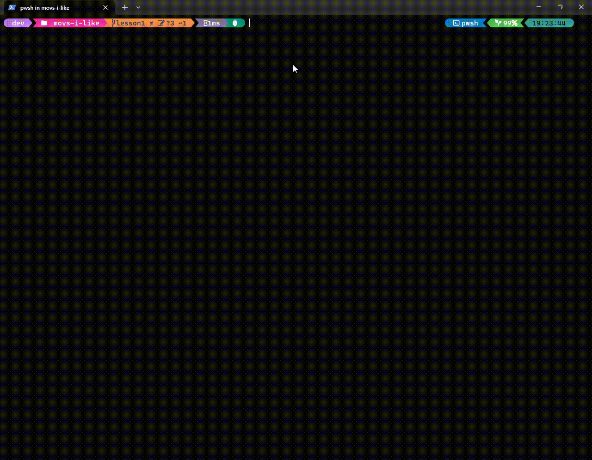

# Alura's Java Immersion ☕ 🚀🚀🚀

Backend development classes with the Java language.
- Project creation
- Practical activities
- Understanding programming concepts
- Object Oriented Paradigm
- Spring framework
- Sticker creation
- Technical challenges
- Other topics

## Lessons

- Lesson 1:
  - Consuming a Movies API with Java
      - Goal: Display in the terminal the top movies returned from some public API, showing title, rating and poster
      - API: https://imdb-api.com
      - We learned about:
        - HttpClient, HttpRequest and HttpResponse for API interaction.
        - List, Map and HashMap for data structuring and manipulation
        - For and While
        - REGEX
        - Display data in the terminal with System.out
  - Challenges proposed by teachers:
      1. Consume the Most Popular Movies endpoint from the IMDB API. Also look for the endpoint in the IMDB API documentation that returns the best series and the one that returns the most popular series.
      1. Use your creativity to make the data output prettier: use emojis with UTF-8 code, show the movie note as little stars, decorate the terminal with colors, bold and italics using ANSI codes, and more!
      1. Put the IMDB API key somewhere outside your code like a configuration file (eg a .properties file) or an environment variable.

# Requirements

- Java SDK 16.0.1 (I developed the project in this version, you can try another)

# Installation

- Clone the project:
  ```sh
  git clone https://github.com/johnny00joe/movs-i-like.git
  ```
  Thats it!

# Program execution

- Access project root folder:
  ```sh
  cd movs-i-like
  ```

- Build:
  ```sh
  javac -d out src/*.java
  ```

- Run:
  ```sh
  java -classpath out src/App.java 
  ```
  
